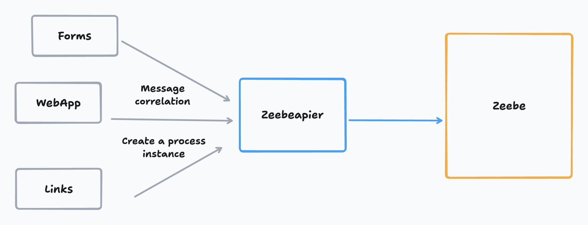

# Zeebeapier

This project provides a gateway to simplify communication between a client application/forms/direct link... and Zeebe. It allows you to trigger process instances and publish messages with correlation using simple HTTP POST requests.





## Features

- **Process Instance Creation**: Easily trigger a process instance using a `processId` with or without variables.
- **Message Publication**: Publish messages with a correlation key, with or without variables.
- **Seamless Integration**: Connect simple HTML forms to Camunda with minimal setup.
- **Environment Configuration**: Minimal & easy configuration. Just check [Camunda's setup guide](https://docs.camunda.io/docs/guides/setup-client-connection-credentials/).

## Get Started

### Prerequisites

- Node.js and npm installed on your machine.
- Camunda Zeebe credentials.

### Installation

1. **Clone the Repository**:

   ```
   git clone https://github.com/marcqw/zeebeapier
   cd zeebeapier
   ```

2. **Configure Environment**:

   - Obtain the necessary credentials from the [Camunda setup guide](https://docs.camunda.io/docs/guides/setup-client-connection-credentials/).
   - Update the `.env` file with these credentials.

3. **Install Dependencies**:

   ```
   npm install
   ```

4. **Start the Server**:

   ```
   npm start
   ```


## Usage

### From an HTML form

```
   <form action="http://localhost:8787/create-process-instance/Process_0a96m0v" method="post">
```

### With an HTTP request
```
curl --location 'http://localhost:8787/create-process-instance/Process_0a96m0v' \
--header 'Content-Type: application/json' \
--data '{
    "best_presales": "William Marcq"
}'
```
## API Reference

#### Create a process instance

```http
  POST /create-process-instance/:processDefinitionId
```

(optionnal) raw Json body with variables.
For forms just add id/name in your form elements.

#### Get item

```http
  GET /publish-message/:messageName/:correlationKey
```

(optionnal) raw Json body with variables.
For forms just add id/name in your form elements.
